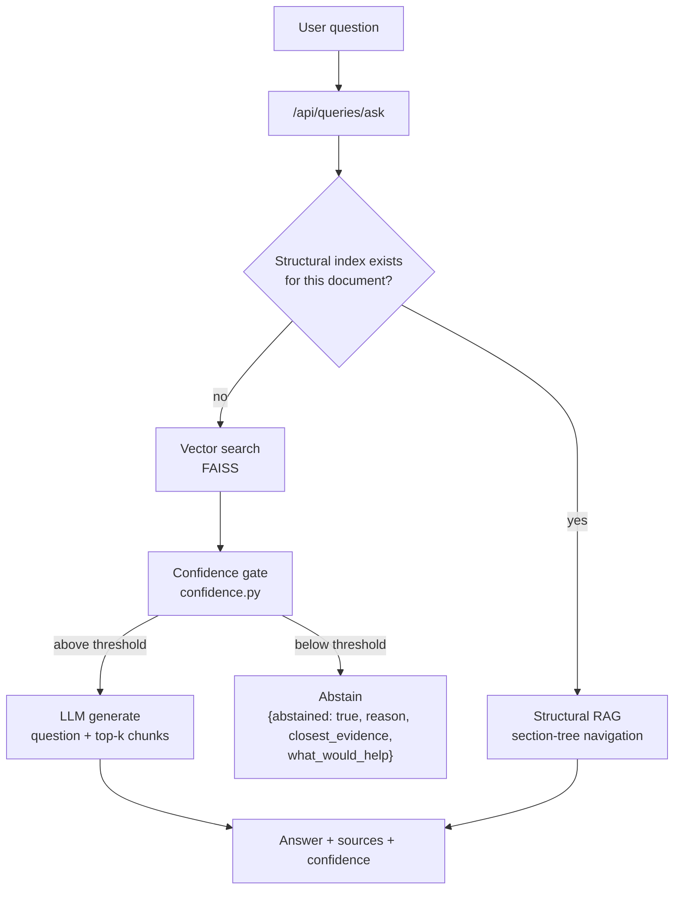
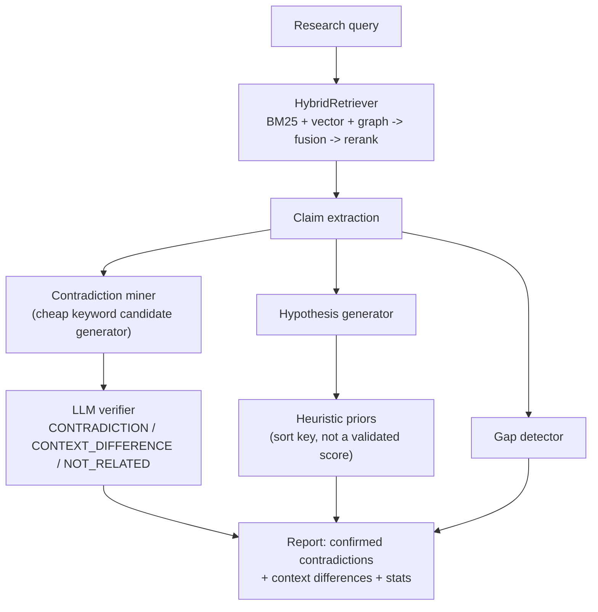

# Architecture

## Request path: asking a question

The confidence gate runs **before** generation, not after: a weak
retrieval can't produce a trustworthy answer no matter how fluent the LLM
makes it sound, so the LLM is never asked to paper over missing evidence.
See `backend/app/services/retrieval/confidence.py` and
`docs/LIMITATIONS.md` for what this gate does and doesn't cover yet
(it's wired into the vector-search fallback only, not the structural path).

## Request path: discovery (gaps, contradictions, hypotheses)

## Why the retrieval stack is three retrievers, not one

`HybridRetriever` (`backend/app/services/retrieval/hybrid_retriever.py`)
combines three retrieval strategies because they fail differently:

- **BM25** (`bm25_retriever.py`) — catches exact terminology (model names,
  dataset names, drug names) that embeddings can blur together.
- **Vector search** (`vector_retriever.py`, FAISS) — catches paraphrase and
  semantic similarity that keyword matching misses.
- **Graph retrieval** (`graph_retriever.py`, Neo4j) — catches connections
  between claims that are related by extracted entities/relationships but
  never share vocabulary at all.

Results are combined with reciprocal rank fusion (`fusion.py`) and
optionally reranked (`reranker.py`). **This has not been measured with a
retrieval ablation yet** (BM25-only vs. vector-only vs. graph-only vs.
fused, on a held-out set) — see `docs/LIMITATIONS.md`. Until that ablation
exists, treat the justification above as the design rationale, not a
proven result.

## Why contradiction detection is two stages, not one

`ContradictionMiner` (keyword/antonym pass over same-entity claim pairs) is
cheap and high-recall but also fires on claims that differ by population,
dataset, dosage, or timeframe — those are context differences, not
contradictions. `ContradictionVerifier` (`contradiction_verifier.py`) is
the second stage: an LLM call per candidate pair that must pick exactly one
of `CONTRADICTION` / `CONTEXT_DIFFERENCE` / `NOT_RELATED`, and must name the
differing condition when it picks `CONTEXT_DIFFERENCE`. The design
principle: don't put an LLM where a keyword list works (candidate
generation is cheap and doesn't need judgment); don't put a keyword list
where judgment is needed (telling a real disagreement from a context
difference does). See `eval/README.md` for how to measure this pair's
precision/recall once a real labeled set exists.

## Provider-agnostic model gateway

`backend/app/services/model_gateway/` defines a `ModelGateway` protocol
(`generate`, `embed`, `rerank`) with four implementations — `groq`,
`openai` (also covers any OpenAI-compatible endpoint, including Ollama),
`fake` (deterministic, no network — used in tests), and a local lexical
embedding fallback used when no embedding API is configured or reachable.
`create_gateway()` (`factory.py`) auto-selects a provider from whichever
API key is set, falling back to `fake` if none are. This is why the system
can run entirely offline for tests and development.

Per-task temperatures are set deliberately, not left at a single default:
extraction and navigation at 0.1 (need consistency, not creativity),
rerank at 0.0 (deterministic ordering), generation at 0.2 (grounded,
citation-style answers should not drift from the evidence), hypothesis
generation at 0.4 (the one place where some creativity is the point).

## Why FAISS, not a hosted vector DB

See `docs/DECISIONS.md`.

## Known architectural rough edges

See `docs/LIMITATIONS.md` for the full list — notably: two
generations of the discovery engine coexist (`app/services/discovery/`
current, `app/services/discovery_engine.py` legacy but still reachable via
one endpoint), and confidence/abstention is implemented three different
ways across the vector RAG path, the structural RAG path, and the unused
`answer_composer.py`.
